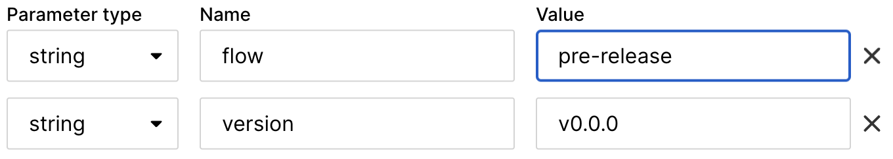
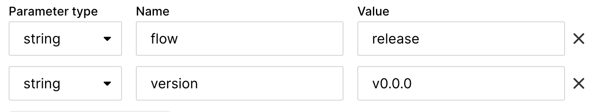

# Release

1. Trigger pipeline on `main` branch from CircleCI UI with the following parameters.
    ```text
    flow: pre-release
    version: v<semantic-version>
    ```
    
    This pipeline will update version in all manifests, create binary artifact, calculate checksum for SwiftPM and attach binary artifact to draft GitHub release.

2. Review and merge PR created by CI automation.
3. Edit GitHub release description and add proper CHANGELOG.
4. Trigger pipeline on `main` branch from CircleCI UI with the following parameters.
    ```text
    flow: release
    version: v<semantic-version>
    ```
    
    This pipeline will validate that checksum of binary artifact equal to checksum in Package.swift, publish GitHub release as pre-release, validate SwfitPM and CocoaPods manifests, publish CocoaPods release.
5. Set newly published GitHub release as latest.